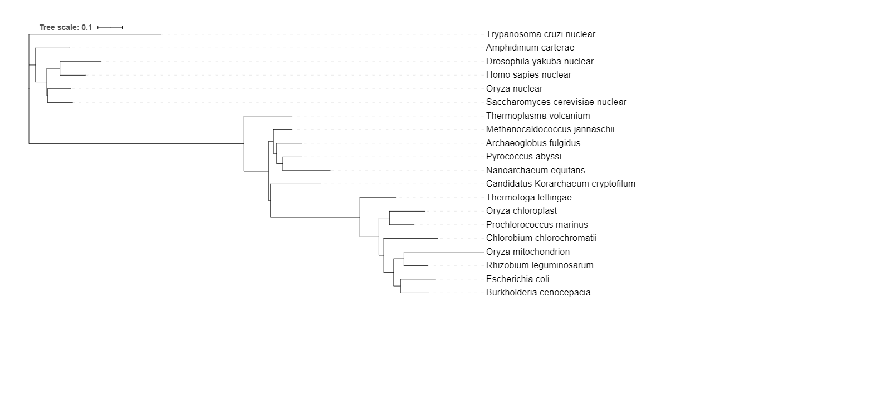

```{r setup, include=FALSE}
knitr::opts_chunk$set(echo = TRUE, warning=FALSE, messages=FALSE)
```

## **NGPhylogeny.Fr Analysis**

**Steps:** 

1. Assemble a group of sequences to evaluate
    + get representative archael, bacterial, and eukaryotic sequences from GenBank
2. Align the sequences so that the distance can be calculated between the sequences
3. Determine the relationship among the sequences
4. Visualize the relationship
5. Steps 2-4 can be done on this website https://ngphylogeny.fr/
    + Select "One Click" under Phylogeny Analysis tab 
    + Paste in core sequences & submit





## **Phylogenic Analysis: CIRPES/MAAFT**

See data folder for the analysis files & last section of lab for graph representation

## **Visualizing & Annotating Phylogenetic Trees w/ R++ggtree**


### Basic Trees

```{r, messages = FALSE, include = FALSE}
#import libraries
library(tidyverse)
library(ggtree)
# added treeio and ggimage library
library(treeio)
library(ggimage)
# need to install libmagick 
#sudo apt-get install libmagick++-dev

```


```{r, messages = FALSE, include = FALSE}
# import tree data

tree <- read.tree("data/tree_newick.nwk")
tree
```


```{r}
# build a ggplot with a geom_tree
ggplot(tree)+ geom_tree() + theme_tree()

# shorthand version
ggtree(tree)
```
```{r}
# add a scale
ggtree(tree) + geom_treescale()

# or add the entire scale to the x axis with theme_tree2()
ggtree(tree) + theme_tree2()
```
```{r}
# default is to plot a phylograpm, where x-axis shows genetic change/evolutionary distance
# if you want to disable scaling & produce cladogram instead

ggtree(tree,branch.length="none")
```
```{r}
# ... option in help for ?ggtree represents additional options that are further passed to ggplot()
# use this to change aesthetics of plot
# draw a cladogram using thick blue dotted lines

ggtree(tree, branch.length = "none", color = "blue", size=2, linetype=3)
```

### Exercise 1

```{r}
# create a slanted phylognetic tree 
ggtree(tree, layout = "slanted")
```
```{r}
# Create a circular phylogenetic tree
ggtree(tree, layout="circular")
```
```{r}
# create a unscaled cladogram w/ thick red lines
ggtree(tree, branch.length="none", color="red", size=2, linetype=3)
```

### Other Tree Geoms

```{r}
# use p to store basic layout of gg plot & add more layers

# create the basic plot
p <- ggtree(tree)

# add node points
p + geom_nodepoint()

# add tip points
p + geom_tippoint()

# label the tips
p + geom_tiplab()
```

### Exercise 2
```{r}
# can change aesthetics of the points by passing graphical parameters inside the geom_nodepoint() or geom_tippoint() calls
# create a phylogeny with the following aesthetics: 
p <- ggtree(tree) 

# tips labeled purple & purple-colored diamond shape tip points & large semitransparent node points & title
p + geom_tiplab(color="purple") + geom_tippoint(col="purple", bg="purple", pch=23) + geom_nodepoint(size = 4, alpha=0.8, color = "yellow") + ggtitle("Exercise 2 Figure")

```

### Tree Annotation

* #### Internal Node Number

```{r}
# to get internal node number, geom_text
# label aesthetic mapping of node
# use hjust to space out labels
ggtree(tree) + geom_text(aes(label=node), hjust=-.3)
```

```{r}
ggtree(tree) + geom_tiplab()
```
```{r}
MRCA(tree, c("C", "E"))
MRCA(tree, c("G", "H"))
```


* #### Labeling Clades

```{r}
# use geom_cladelabel() to add another geom layer to aanotate a selected clade 

#annotate node 17
ggtree(tree) + 
  geom_cladelabel(node=17, label="Some random clade", color="red")

# add tip labels 
ggtree(tree) + 
  geom_tiplab() + 
  geom_cladelabel(node=17, label="Some random clade", 
                  color="red2", offset=.8)

# add another label for node 21 
ggtree(tree) + 
  geom_tiplab() + 
  geom_cladelabel(node=17, label="Some random clade", 
                  color="red2", offset=.8) + 
  geom_cladelabel(node=21, label="A different clade", 
                  color="blue", offset=.8)
```

```{r}
# use align= TRUE 
ggtree(tree) + 
  geom_tiplab() + 
  geom_cladelabel(node=17, label="Some random clade", 
                  color="red2", offset=.8, align=TRUE) + 
  geom_cladelabel(node=21, label="A different clade", 
                  color="blue", offset=.8, align=TRUE) + 
  theme_tree2() + 
  xlim(0, 70) +  #set limit on x-axis
  theme_tree()   #add another theme on top to get rid of scale
```
```{r}
# highlight entire clade with geom_hilight()

ggtree(tree) + 
  geom_tiplab() + 
  geom_hilight(node=17, fill="gold") + 
  geom_hilight(node=21, fill="purple")
```

* #### Connecting Taxa

```{r, warning=FALSE, messages=FALSE}
# geom_taxalink() layer draws straight ot cruved lines between 2 nodes, shows evolutionary events
ggtree(tree) + 
  geom_tiplab() + 
  geom_taxalink("E", "H", color="blue3") +
  geom_taxalink("C", "G", color="orange2", curvature=-.9)
```

### Exercise 3


```{r}
# determine nodes w/ MRCA() function
MRCA(tree, c("B", "C")) #node 19

MRCA(tree, c("L", "J")) #node 23
```

```{r, warning=FALSE, messages=FALSE}
# draw the tree
ggtree(tree) +
geom_tiplab() + 
  geom_hilight(node=19, fill="blue") + 
  geom_hilight(node=23, fill="yellow") +
  geom_cladelabel(node=17, label="Superclade 17", color="red2", offset=-7, align=TRUE) +
  geom_taxalink("C", "E", color="grey", linetype=2) +
  geom_taxalink("G", "J", color="grey",linetype=2) +
  theme_tree2() + 
  xlim(0, 60)+ 
  ggtitle("Exercise 3 Figure (Circular)")
 
```

```{r,warning=FALSE, messages=FALSE}
# Circular version of Exercise 3

ggtree(tree, layout="circular") +
geom_tiplab() + 
  geom_hilight(node=19, fill="blue") + 
  geom_hilight(node=23, fill="yellow") +
  geom_cladelabel(node=17, label="Superclade 17", color="red2", offset=-7, align=TRUE) +
  geom_taxalink("C", "E", color="grey", linetype=2) +
  geom_taxalink("G", "J", color="grey",linetype=2) +
  theme_tree2() + 
  xlim(0, 60)+ 
  ggtitle("Exercise 3 Figure")
```


### Advanced Tree Annotation

```{r}
# Read the data
tree <- read.beast("data/flu_tree_beast.tree")
# supply a most recent sampling date so you get the dates
# and add a scale bar
ggtree(tree, mrsd="2013-01-01") + 
  theme_tree2() 
# Finally, add tip labels and adjust axis
ggtree(tree, mrsd="2013-01-01") + 
  theme_tree2() + 
  geom_tiplab(align=TRUE, linesize=.5) + 
  xlim(1990, 2020)
```


```{r}
# msaplot puts multiple sequence alignment & the tree side by side

tree <- read.beast("data/flu_tree_beast.tree")
p <- ggtree(tree)
fasta <- "data/flu_aasequence.fasta"
msaplot(p, fasta, window=c(150, 175))
```

### Bonus

* #### Many Trees

```{r}
set.seed(42)
trees <- lapply(rep(c(10, 25, 50, 100), 3), rtree)
class(trees) <- "multiPhylo"
ggtree(trees) + facet_wrap(~.id, scale="free", ncol=4) + ggtitle("Many trees. Such phylogenetics. Wow.")
```
* #### Plot Tree w/ Other Data

```{r}
# face_plot function accepts a input data.frame (your data) 

# Generate a random tree with 30 tips
tree <- rtree(30)

# Make the original plot
p <- ggtree(tree)

# generate some random values for each tip label in the data
d1 <- data.frame(id=tree$tip.label, val=rnorm(30, sd=3))

# Make a second plot with the original, naming the new plot "dot", 
# using the data you just created, with a point geom.
p2 <- facet_plot(p, panel="dot", data=d1, geom=geom_point, aes(x=val), color='red3')

# Make some more data with another random value.
d2 <- data.frame(id=tree$tip.label, value = abs(rnorm(30, mean=100, sd=50)))

# Now add to that second plot, this time using the new d2 data above, 
# This time showing a bar segment, size 3, colored blue.
p3 <- facet_plot(p2, panel='bar', data=d2, geom=geom_segment, 
           aes(x=0, xend=value, y=y, yend=y), size=3, color='blue4')

# Show all three plots with a scale
p3 + theme_tree2()
```


* #### Overlay Organism Silhouettes

```{r}
# phylopic.org hosts free silhouettes of animals/plants/etc, can place the image at a node via ggtree

# get phylopic 
newick <- "((Pongo_abelii,(Gorilla_gorilla_gorilla,(Pan_paniscus,Pan_troglodytes)Pan,Homo_sapiens)Homininae)Hominidae,Nomascus_leucogenys)Hominoidea;"

tree <- read.tree(text=newick)

d <- ggimage::phylopic_uid(tree$tip.label)
d$body_mass = c(52, 114, 47, 45, 58, 6)

p <- ggtree(tree) %<+% d + 
  geom_tiplab(aes(image=uid, colour=body_mass), geom="phylopic", offset=2.5) +
  geom_tiplab(aes(label=label), offset = .2) + xlim(NA, 7) +
  scale_color_viridis_c()
p  

```

## **Phylogenic Analysis: CIRPES/MAAFT**
```{r}
tree <- read.newick("data/fastree_result.tre")
ggtree(tree, layout="circular") +
  xlim(0,2) + 
  geom_nodelab() +
    geom_tiplab(hjust=-.1, size = 3) +
  geom_highlight(node=22, fill = "orange", extend = 0.1, alpha=0.5) +
  geom_hilight(node=25, fill="purple", extend = 0.1, alpha = 0.4) +
    geom_hilight(node=30, fill="blue", extend = 0.3, alpha=0.4) 
```
