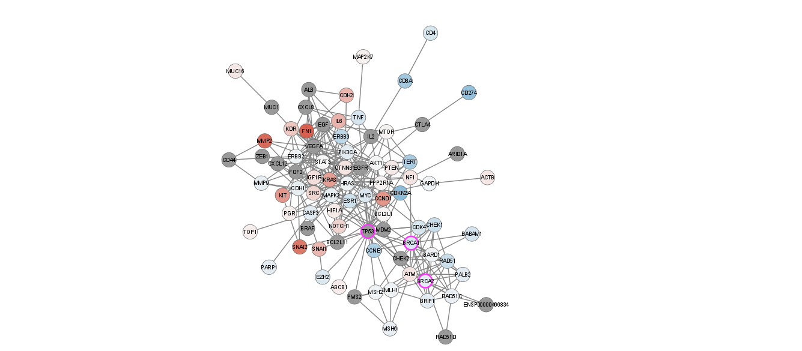
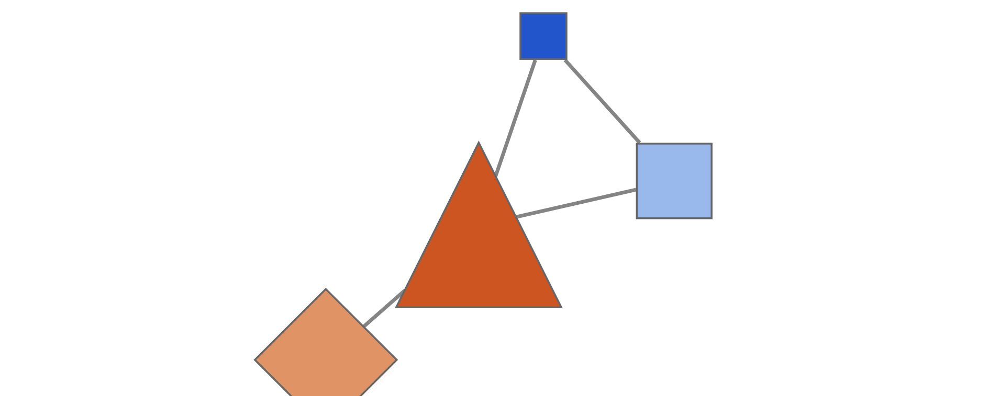

```{r setup, include=FALSE}
knitr::opts_chunk$set(echo = FALSE)
```
### **Cytoscape Exercises**
#### Basic Data Visualization Graph


#### Differentially Expressed Genes Graph



### **RCy3 Exercises**


```{r, include = FALSE}
library(RCy3)
cytoscapePing()
```


