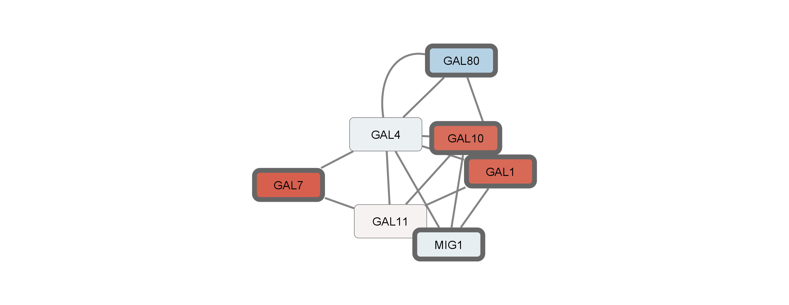
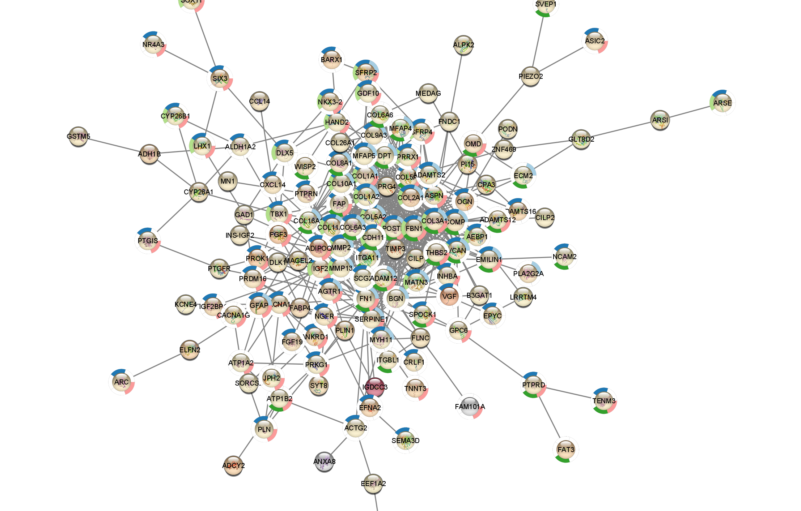
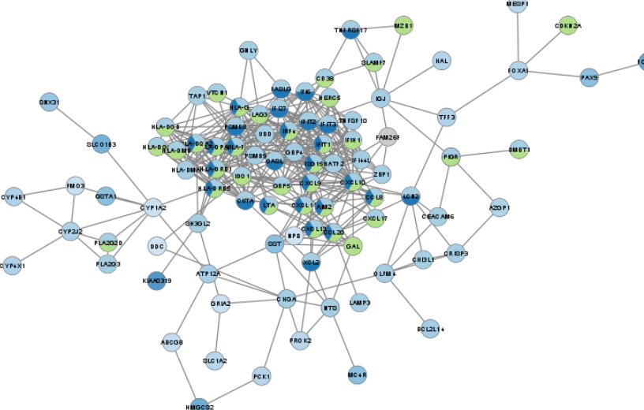
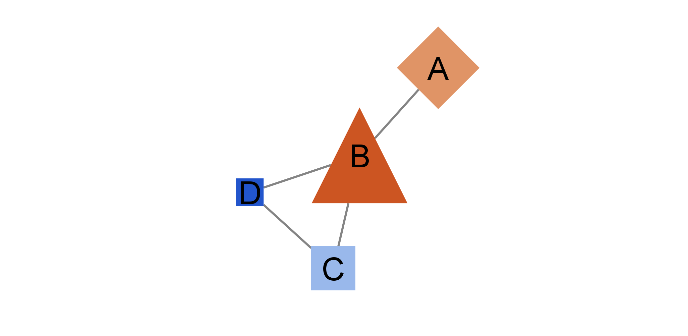

```{r setup, include=FALSE}
knitr::opts_chunk$set(echo = FALSE)
```
### **Cytoscape Exercises**
#### Basic Data Visualization Graph


#### Differentially Expressed Genes Graph

* **Up-regulated Genes**


* **Down-regulated Genes**



* **Ovarian Cancer** 


### **RCy3 Exercise**


